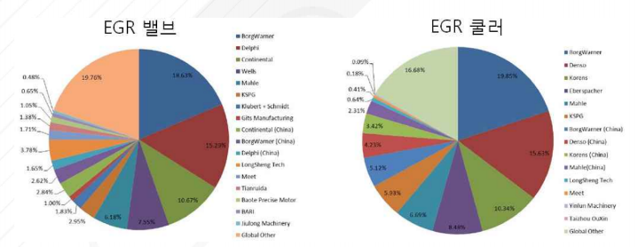

# 배기가스 재순환장치 - 해외 시장 규모

현대 산업 발달로 인하여 세계 자동차 생산 대수는 꾸준히 증가하고 그에 따른 환경오염 문제들은 자연스럽게 친환경, 에너지 문제 등에 대한 관심 증가로 이어지고 있으며, 배기가스 배출에 대한 각종 규제로 인하여 EGR 시스템에 대한 기술발전 및 시장 수요는 지속적으로 확대될 전망입니다.

2014년 기준 세계 자동차 시장은 89,700,000대로 2013년도 대비 약 3.6%의 성장률을 보였으며 그 중 중국 시장은 약 23,700,000대를 차지하여 자동차 시장을 주도하고 있습니다. 이어 미국 11,700,000대, 일본 9,800,000대를 차지하고 있습니다. 근래 들어 수소 및 전기자동차 등의 친환경 자동차의 관심이 늘어나고 있지만, 현재까지는 기존의 엔진 장착 차량 점유율 및 수요가 여전히 앞서고 있는 상황이며 EGR 시스템의 기술 특성상 이러한 엔진 장착 기반의 차량에 적용되는 점에 있어 EGR 기술에 대한 시장 수요는 꾸준히 증가할 것으로 예상됩니다.

EGR 시스템은 크게 EGR 밸브 및 EGR 쿨러로, EGR 밸브여 전세계 규모(수)는 2010년 1,273,920개에서 2015년 1,939,110개로 증가했으며 주요 국가별 제품 규모는 2015년에 유럽 > 미국 > 중국 순입니다. 또한, EGR 쿨러에 관하여 전 세계 제품 규모(수)는 2010년 1,185,140개에서 2015년 1,844,640개로 증가하였으며 주요 국가별 제품 규모는 2015년에 유럽 > 미국 > 중국 순입니다. 세계 자동차 시장에서 중국이 차지하고 있는 수에 비해 유럽의 EGR 시스템 점유율이 월등히 높은 이유는 유럽의 강력한 배기가스 규제에 대한 영향 때문이라고 판단됩니다. EGR 시스템의 세계 시장규모는 2015년 1,515.9억 달러에서 2020년 2,086.7억 달러로 성장이 예상됩니다.

## 참고문서
- BOSS report: 22-2016-자동차 배기가스 재순환을 통한 오염물질 저감의 ERG 시스템.pdf
