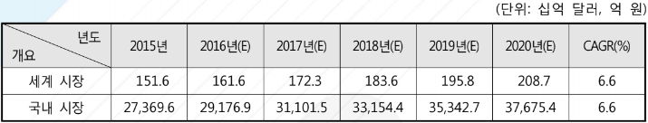

# 배기가스 재순환장치 국내 시장의 크기는?

현대 산업 발달로 인하여 세계 자동차 생산 대수는 꾸준히 증가하고 그에 따른 환경오염 문제들은 자연스럽게 친환경, 에너지 문제 등에 대한 관심 증가로 이어지고 있으며, 배기가스 배출에 대한 각종 규제로 인하여 EGR 시스템에 대한 기술발전 및 시장 수요는 지속적으로 확대될 전망입니다. 
국내의 경우 2012년부터 자동차 제작 및 수입업체는 판매되는 자동차의 온실가스 평균 배출량이 140g/km를 만족하도록 자동차를 제작·판매해야 하는 자동차 온실가스 배출 규제가 최초로 시행되었으며, 2012년부터 단계적으로 적용되어 2015년부터 국내 판매되는 10인승 이하 승용 및 승합자동차 전체에 적용되고 있습니다. 
또한, 유로 6의 강화되는 규제에 맞춰 내연기관 내의 부품 개선을 위한 연구개발에 노력을 기울이고 있는 상황입니다. 
EGR 시스템의 국내 시장규모는 2015년 2조 7,369.6억 원 규모에서 2020년 3조 7,675.4억 원 규모로 성장 할 것으로 예상됩니다.

## 참고문서 
- 22-2016-자동차 배기가스 재순환을 통한 오염물질 저감의 ERG 시스템.pdf
