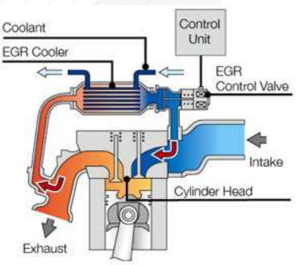

# 배기가스 재순환장치의 정의는?

현대 산업사회는 인구의 증가, 산업의 발전, 소비의 증대로 인하여 물적 자원에 대한 수요가 급격히 증대됨에 따라 막대한 양의 폐기물, 독성 화합물, 방사능 물질, 매연 등이 발생하고 있습니다. 
이러한 상황에서 자동차 산업에서는 유럽연합(EU)이 도입한 경유차 배기가스 규제인 유로 규제를 통하여 환경보호에 나서고 있으며, 관련 기술로는 DPF(Diesel Particulate Filter), SCR(Selective Catalyst Reduction), EGR(Exhaust Gas Recirculation) 등의 배기가스 저감 기술이 있습니다. 
DPF 기술은 경유가 불완전 연소되어 발생하는 유해물질 등의 찌꺼기를 필터로 걸러내어 550도 정도의 높은 온도로 재차 태워 오염물질을 줄이는 기술이며, SCR 기술은 자동차 연소시 배출되는 질소산화물에 ‘요소수’라 불리는 암모니아 수용액을 분사시켜 질소 산화물을 인체에 무해한 질소(N2) 와 물(H20)로 변화하는 기술입니다. 
EGR 기술은 자동차의 엔진 연소실에서 발생된 배기가스, 블로바이 가스, 연료 증발가스 등을 엔진 흡기부로 다시 한 번 순환시켜 최종 배기가스 내의 NOx 저감함을 주목적으로 하는 기술입니다. 
EGR 시스템의 주요 구성요소로는 밸브, 쿨러 등이며 EGR 밸브는 재순환 통로상에 설치되어 엔진의 회전속도 및 부하 상태에 따라 재순환 가스양을 조절하는 기능을 하고 EGR 쿨러는 엔진에서 배출되는 높은 온도의 배기가스로 인하여 재순환시 NOx 저감 효율 저하의 문제를 방지하기 위한 일종의 열 교환기입니다. 
EGR 기술의 경우 미국의 GM(General Motors)이 1973년에 처음으로 차량에 적용하였습니다.

## 참고문서 
- 22-2016-자동차 배기가스 재순환을 통한 오염물질 저감의 ERG 시스템.pdf

