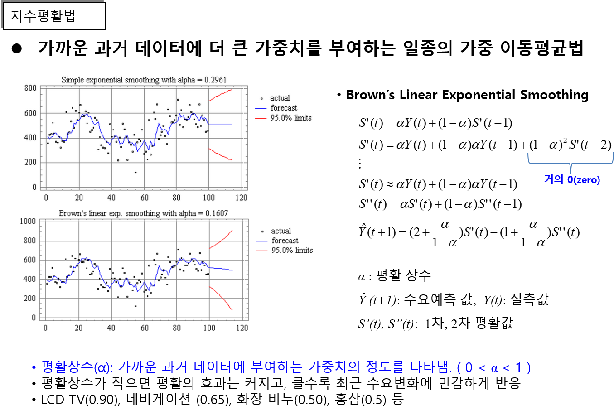

## 시장규모 및 성장률 예측 - 지수평활법

예측변수들의 가까운 과거 데이터에 더 큰 가중치를 부여하는 일종의 가중 이동평균법이며, 여기서 가까운 과거 데이터에 부여하는 가중치의 정도를 평활상수(á) ( 0 < á < 1 )로 나타냄. 즉, 평활상수가 작으면 평활의 효과는 커지고, 클수록 최근 수요변화에 민감하게 반응하는데, LCD TV(0.90), 네비게이션 (0.65), 화장 비누(0.50), 홍삼(0.5) 등의 값을 보임.

출처: 시장성 분석 교육자료(한국기업기술가치평가협회, 2018)
