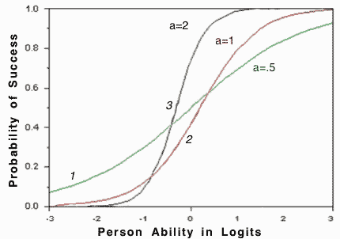
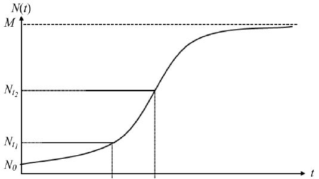

## 시장규모 및 성장률 예측 - 로지스틱법

로지스틱기법은 선형 회귀모형과 달리 결과 변수(종속변수)가 범주형 데이터인 경우 사용되는 기법으로, 최대 시장규모를 향해 S-shape으로 성장하는 패턴을 따른다는 가정에 근거하는 예측기법임. 로지스틱 회귀곡선은 아래 곡선 형태와 같이, 입력은 연속형 독립변수인데 반해, 출력이 0과 1사이(threshold value: 0.5) 값을 지님.

출처: 시장성 분석 교육자료(한국기업기술가치평가협회, 2018)

신제품 확산모형 분야에서 로지스틱모형은 다음과 같이 내부영향계수(b)에 영향을 받은 잠재수요(market potential)의 전기 및 당기 채택자수를 분석하는 모형임.

