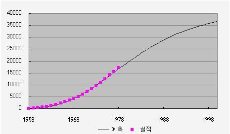

## 시장규모 및 성장률 예측 - 콤페르츠법

콤페르츠 모형의 일반적인 형태는 다음과 같으며, K는 시장 잠재 수요를 나타냄.

출처: 시장성 분석 교육자료(한국기업기술가치평가협회, 2018)

예를 들어, 관찰수, 기간에 따른 연간매출액 데이터가 있다고 하자. 누적매출액을 log 함수를 이용하여 부분 총합을 계산하고 상기 식의 굴곡점(투자회수기간, 출시 제품의 포화시점)을 구하는 미분방정식을 풀면, 모수 b, a, K 순으로 산출 가능하며 이를 토대로 Y의 향후 추정이 가능해짐.
