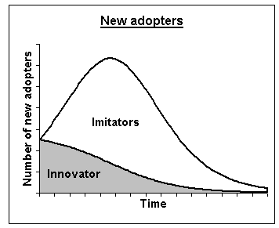

## 시장규모 및 성장률 예측 - BASS모형

제품이 구성원들 사이에서 대중매체나 구전의 영향으로 퍼져나가는 과정을 모델링한 기법으로 신제품의 수요 예측에 주로 사용됨. BASS모형은 잠재수요를 비롯하여 대중매체와 구전의 영향을 결정하는 각각의 계수만 추정하면 수요 모델이 결정되는 특징을 지님(초기 데이터 이용, 전문가의 경험 활용, 유사 사례 적용 등으로 추정).
대표적인 사례로는 컬러 TV, VCR, PC 등 새로운 전자제품의 수요 예측이며, PC나 TV처럼 기능이 개선되어 신제품이 출시되는 경우는 기본 확산 모형에 기술대체 모델을 접목하여 세대 간 대체를 반영한 모델을 적용함.

출처: 시장성 분석 교육자료(한국기업기술가치평가협회, 2018), STAR-Value 홈페이지(http://www.starvalue.or.kr 참고

앞에서 설명된 바와 같이, 로지스틱 모형은 Bass 확산모형의 특수한 경우(내부영향만 고려)이며, Bass 모형은 채택자수의 증가가 기존 채택자수(모방계수 q)에 영향을 받는 것과 별도로 외부 영향(마케팅이나 가격: 혁신계수 p)을 동시에 받아서 생기는 혼합 영향모형을 의미함.
