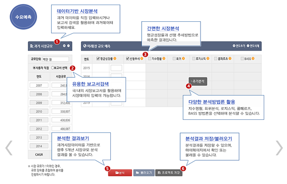
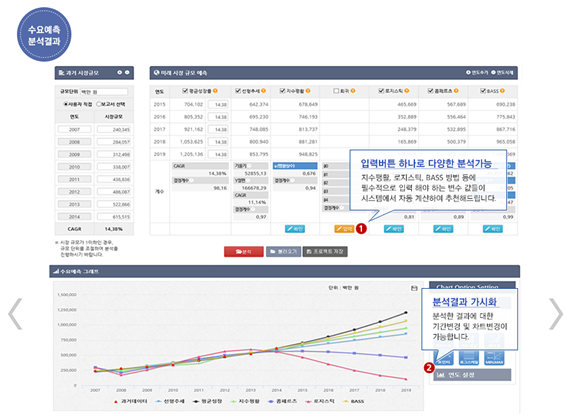

## 수요예측을 KMAPS에서 하는 법

##### (KMAPS > 시장분석 > 수요예측)
수요예측을 위해 사용자가 과거데이터를 직접 입력하거나 산업분류 선택 또는 보고서 검색 등을 통해 과거 데이터를 자동으로 불러올 수 있음. KMAPS에서는 기본적으로 평균성장률과 선형추세방법을 이용하여 과거데이터를 기반으로 미래시장 규모를 예측하여 보여줌. 이외에, 사용자가 추가적으로 다양한 분석방법론(지수평활, 회귀분석, 로지스틱, 콤페르츠, BASS)을 활용하고자 할 경우에도 이를 선택하여 수요예측을 진행할 수 있음.

