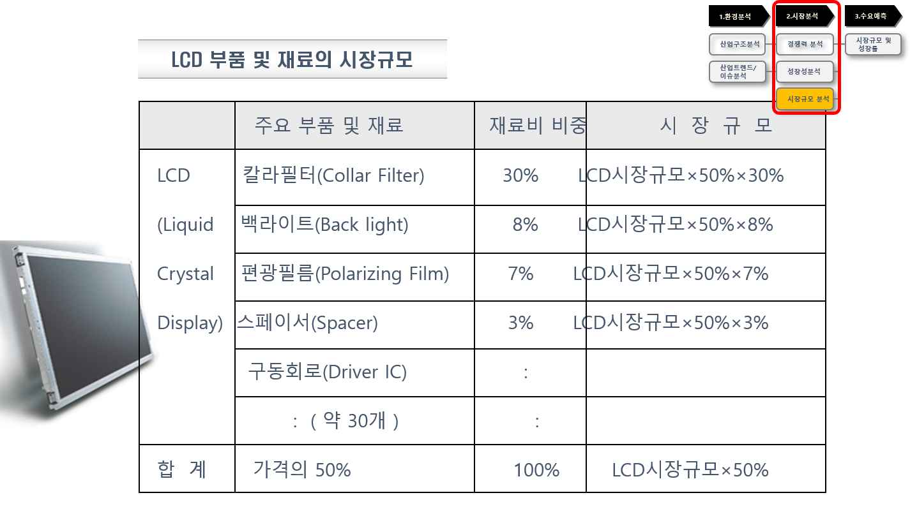

## 시장규모 분석 - 생산량 기준 시장규모

다음은 LCD 부품에 대한 재료비 비중을 고려하여 시장규모를 산출한 사례이며, 전체 LCD시장규모가 1조원이라고 가정할 때, 백라이트의 시장규모는 1조원 * 50% * 8% = 400억원이 됨.

<그림 24> LCD 백라이트에 대한 시장규모 산출 사례
출처: 시장성 분석 교육자료(한국기업기술가치평가협회, 2018)
