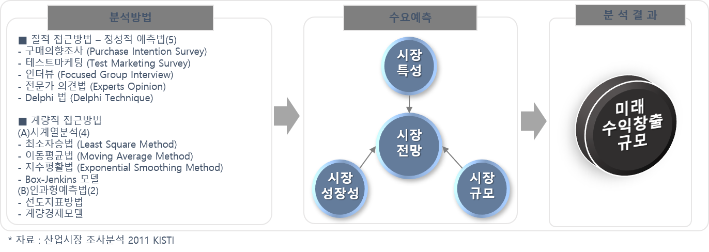

## 시장 성장률 구하는 방법?

목표 시장의 분석결과(규모, 특성 등)를 바탕으로 촉진/저해 요인을 분석하고, 시장규모 및 시장성장성을 추정하여 미래 수익창출 규모를 파악함. 여기서는 정성적 판단기법, 인과모형, 시계열 기법으로 구분하여 설명함.
또한, 산업 성숙단계별 적용상황에 따라, 최적의 수요예측 기법을 활용할 수 있도록 아래 <표>에 설명함.

출처: 시장성 분석 교육자료(한국기업기술가치평가협회, 2018)
