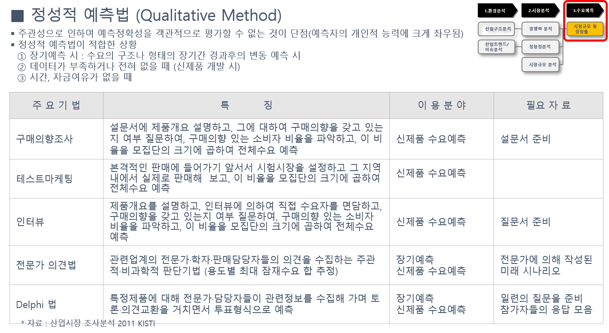

## 시장규모 및 성장률 예측 - 정성적 판단

정성적 판단기법에는 델파이기법, 시나리오기법, 전문가의견법 등이 있으며, 주관성으로 인하여 예측정확성을 객관적으로 평가할 수 없는 것이 단점임(예측자의 개인적 능력에 크게 좌우됨).

이러한 정성적 예측법이 적합한 상황은 다음과 같음.
- 장기예측 시 : 수요의 구조나 형태의 장기간 경과후의 변동 예측 시
- 데이터가 부족하거나 전혀 없을 때 (신제품 개발 시)
- 시간, 자금여유가 있을 때

출처: 시장성 분석 교육자료(한국기업기술가치평가협회, 2018)
