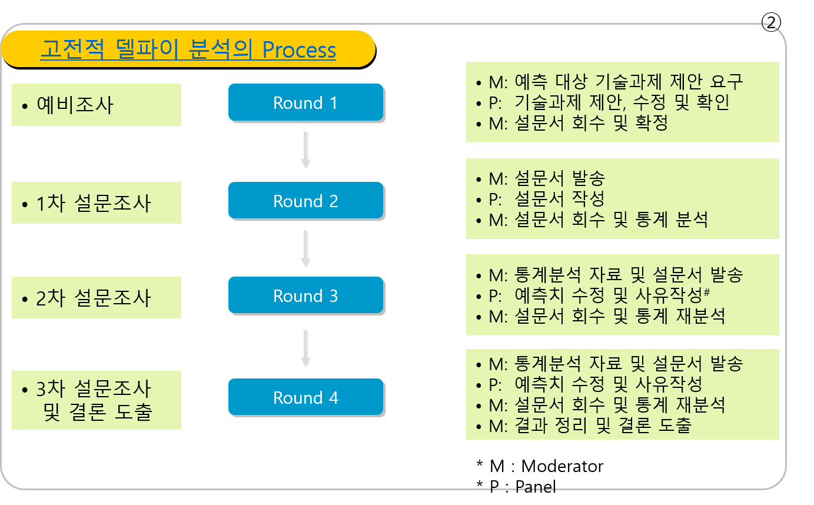

## 시장규모 및 성장률 예측 - 시나리오 기법

시나리오 기법은 전략적 리스크를 최소화할 목적으로 변화동인을 통해 불확실성을 파악하고 여러가지 시나리오 도출을 통해 대응책을 준비하는 기법임.
시나리오를 수립하는 두가지 방법은 Future Forward(FF)와 Future Backward(FB)가 있으며, 아래에서 시나리오 기법의 절차는 Phase 1~Phase 7로 구성됨.

| 기법            | 설명                                                             | 접근법 / 예    |
|-----------------|------------------------------------------------------------------|----------------|
| Future Forward  | 변화동인 기반의 여러 가지의 시나리오 도출후 각각의 대응책을 마련 | 현재   -> 미래  예. 유가, 환율로부터 원유도입방식 변경, 환햇지|
| Future Backward | 미래상황을 예측 결정후 대응책을 마련                             | 미래   -> 현재  예. 9.11테러 예측 준비|

시나리오 기법의 두가지 방법

출처: ㈜씨에스리 컨설팅자료를 기반으로 재작성

시나리오 기법은 불확정성 하의 Single Point Forecast가 본질적으로 부정확하다는 단점을 보완해주며, 사업에 영향을 미치는 주요 외부 환경 동인을 이해하고 발생 가능한 미래 상황에 대한 사전 체험하여, 미래의 예측하지 못한 환경 변화에 대한 신속하고 유연한 대응을 할 수 있게 해 줌.
