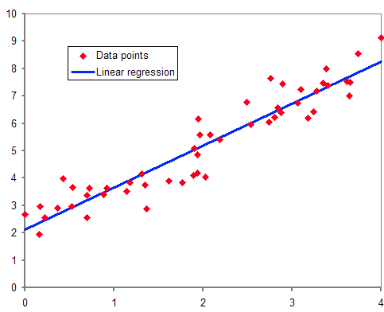

## 시장규모 및 성장률 예측 - 인과모형 성장률 예측

1. 선도지표
어떤 경제활동이 특정방향에서 타 경제활동에 앞서가는 경우, 전자를 선도지표로 보고 예측에 이용하는 방법이며, 대체 및 유사 제품으로부터의 예측방법으로 유사제품 년도별 판매 추이를 준용하여 신제품 수요예측에 적용하는 기법임.

출처: 기술사업화 이론과 사례(한국기업기술가치평가협회, 2018)

2. 계량경제모형
원래 계량경제모형은 경제 전체의 흐름 또는 움직임을 경제이론에 기초해서 다수의 형태방정식(예. 구조방정식) 형태로 축양하여 경제예측이나 경제정책의 효과분석에 쓰는 틀을 의미하나, 시장분석 분야에서는 흔히 예측변수들의 회귀방정식을 추정하고 회귀변수를 이용하여 수요량을 예측하는 회귀모형을 일컬음. 두 개 이상의 독립변수에 대한 과거자료가 있을 경우, 제품별 판매예측에 활용할 수 있음.

출처: 시장성 분석 교육자료(한국기업기술가치평가협회, 2018); 위키피디아의 선형회귀 설명을 참조
