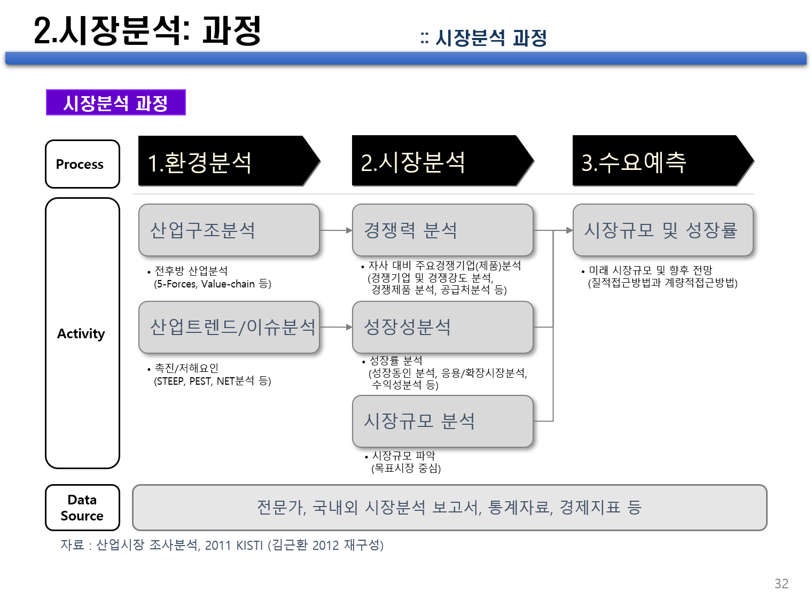

## 산업구조분석이란?

산업시장정보 분석은 대상기술 제품이 속한 산업 및 시장영역에 대해서, 환경분석, 경쟁분석 결과에 근거하여 시장경쟁력을 평가하고 나아가 대상기술 제품의 시장규모 및 성장률 예측을 기반으로 수요를 예측하는 일련의 과정을 포함함.

따라서, 산업시장정보 분석은 해당 산업분야와 대상기술의 시장에 대한 정의와 범위를 명확히 설정하고, 대상기술이 속한 산업의 특성 및 환경, 시장구조, 제품현황, 시장진입장벽, 국내외 시장 및 업체동향에 대한 분석 결과를 기반으로 적용제품의 시장규모와 추정매출의 예측에 사용할 객관적인 정보를 제공하는 중요한 분석단계이며, 구체적으로는 환경분석과 시장분석, 수요예측의 단계로 나눔.

