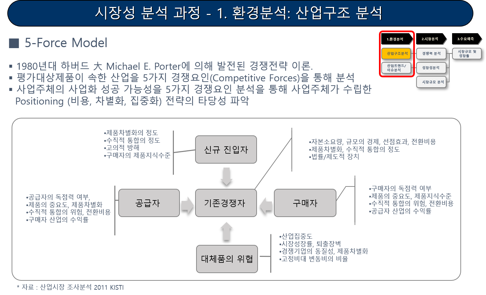

## 5-force 분석이란?

5-force 모델은 하버드대학의 명예교수인 Michael Porter에 의해 1979년 HBR 논문에서 처음 언급되었으며, 산업 환경에 영향을 미치는 다섯가지 요인 (5 forces)으로 신규 진입의 위협, 공급자의 협상력, 구매자의 협상력, 대체재, 기존 사업자를 들고 있음. Porter는 이 다섯 가지 원동력을 분석하고, 기업의 내부 역량을 함께 고려함으로써 어떤 위협에 맞서 싸우고, 어떤 위협을 회피해야 할 것인지를 효과적으로 결정할 수 있을 것이라고 말하고 있음.

따라서, 5-force 분석은 산업의 구조가 기업의 경쟁력에 핵심적인 역할을 한다고 생각하는 이론의 기반 하에, 기업의 경쟁 환경을 분석하기 위한 도구로서 매우 유용하고 분석이 쉬운 특징이 있음.

출처: 출처: 시장성 분석 교육자료(한국기업기술가치평가협회, 2018), 산업시장조사분석 교육자료(KISTI, 2017)
