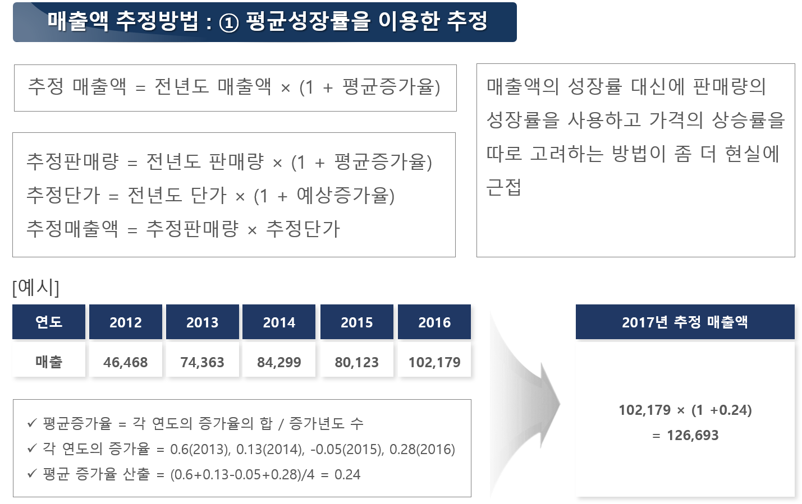
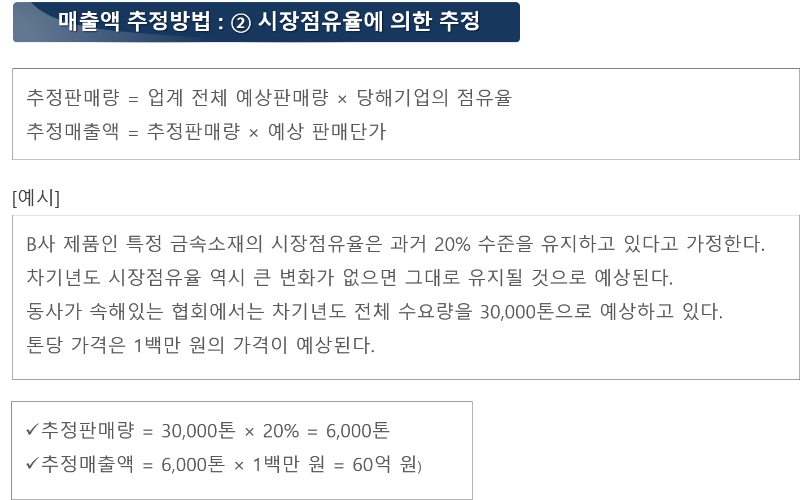
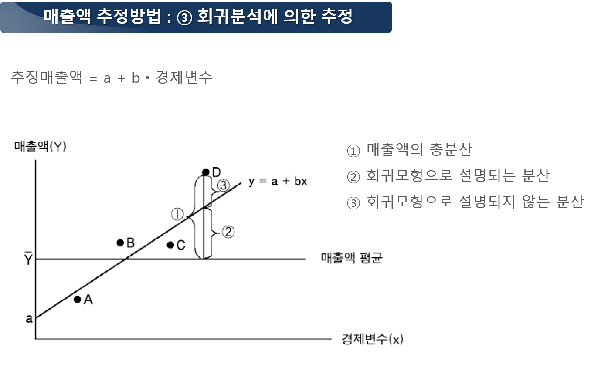

## 시장점유율 분석이란?

 산업시장정보 분석의 3단계에 해당하는 수요예측에 있어서, 시장규모를 추정하는 절차만큼 중요한 것이 시장점유율을 분석하는 것임. 이는 전체업계 및 대상회사의 생산능력을 기반으로 시장경쟁력(가격, 품질, 수급구조 등) 측면과 생산투입요소(원자재 조달 가능성 등) 측면을 고려하여 결정됨.

출처: 시장성 분석 교육자료(한국기업기술가치평가협회, 2018), 산업시장조사분석 교육자료(KISTI, 2017)

시장점유율(M/S: market share)은 FnGuide 등의 기업(또는 제품) 분석 보고서 상의 파이차트(pi chart)를 통해, 해당 업종에서의 점유율 정보를 참조하기도 함.

출처: 시장성 분석 교육자료(한국기업기술가치평가협회, 2018)

다음은 수요예측에 주로 이용되는 3가지 매출액 추정절차를 보여줌.
1. 평균성장률 이용
출처: 기술사업화의 이론과 사례(한국기업기술가치평가협회, 2018)

2. 시장점유율 이용

출처: 기술사업화의 이론과 사례(한국기업기술가치평가협회, 2018)

3. 회귀분석 이용

출처: 기술사업화의 이론과 사례(한국기업기술가치평가협회, 2018)
