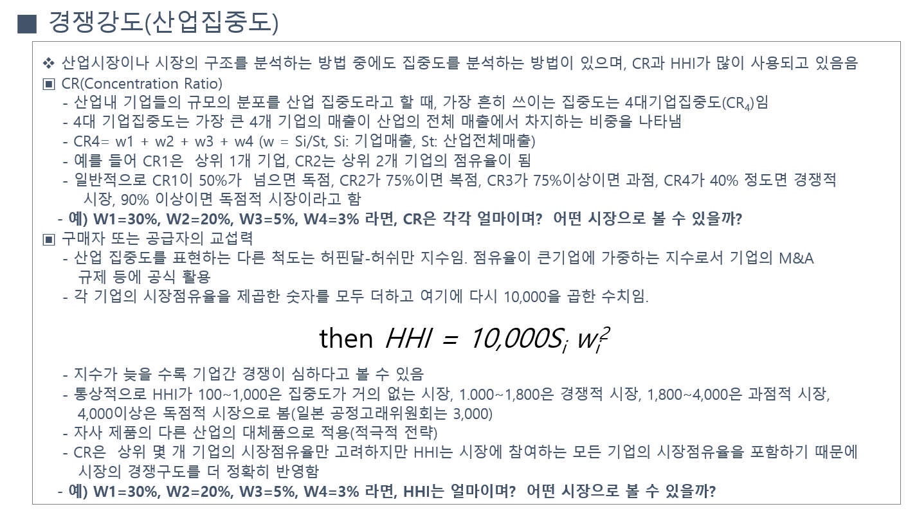
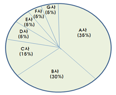

## 산업구조분석: 시장집중도 분석

산업시장의 구조를 분석하는 방법 중에서 독점․복점․과점․경쟁적 시장구조인지를 구분하는 집중도 지수를 흔히 이용하는데, 주로 CR과 HHI가 많이 사용되고 있음.

출처: 시장성 분석 교육자료(한국기업기술가치평가협회, 2018)

예를 들어, 대상 제품에 대한 점유율 구조가 A사(35%), B사(30%), C사(15%), D사(5%) 등으로 구성될 경우, CR4지수는 80%이고, HHI는 2,450(1,800과 4,000 사이)이므로 시장구조가 과점 형태라 볼 수 있음.

