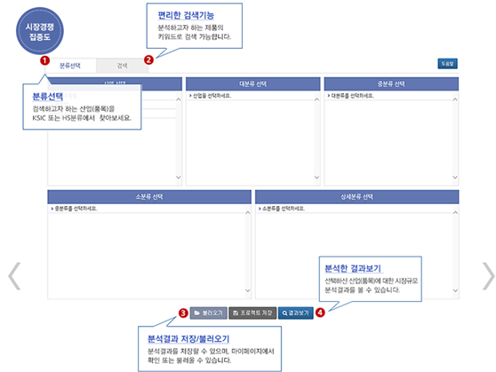
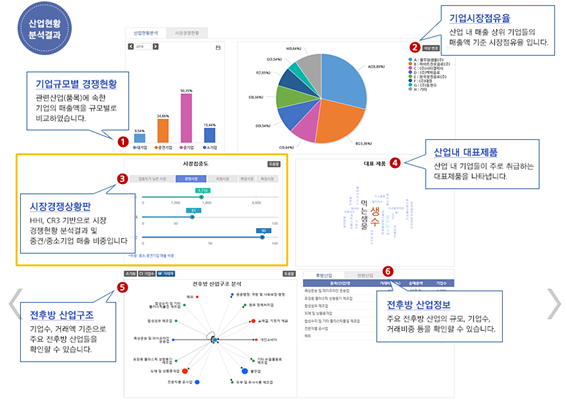
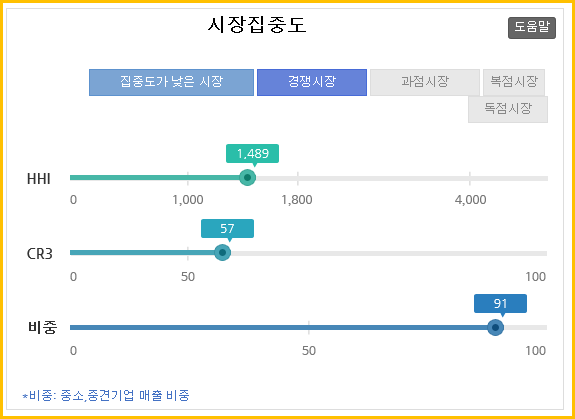

## 산업구조분석: 시장집중도 분석 - KMAPS 활용법
#### (KMAPS > 산업구조분석 > 시장경쟁·집중도 분석)

KMAPS를 활용하여 시장 집중도를 분석하고자 하는 경우, 산업구조 분석 메뉴에서 시장경쟁·집중도 분석 메뉴를 이용할 수 있음. 사용자가 분석하고자 하는 산업(품목)을 분류선택 또는 검색기능을 통해 선택하면, 분석 결과 화면에서 선택한 산업(품목)에 대한 주요 기업들의 시장 점유율, 시장 경쟁 현황, 시장집중도, 대표제품 등 전반적인 산업현황에 대한 정보를 확인할 수 있음.

