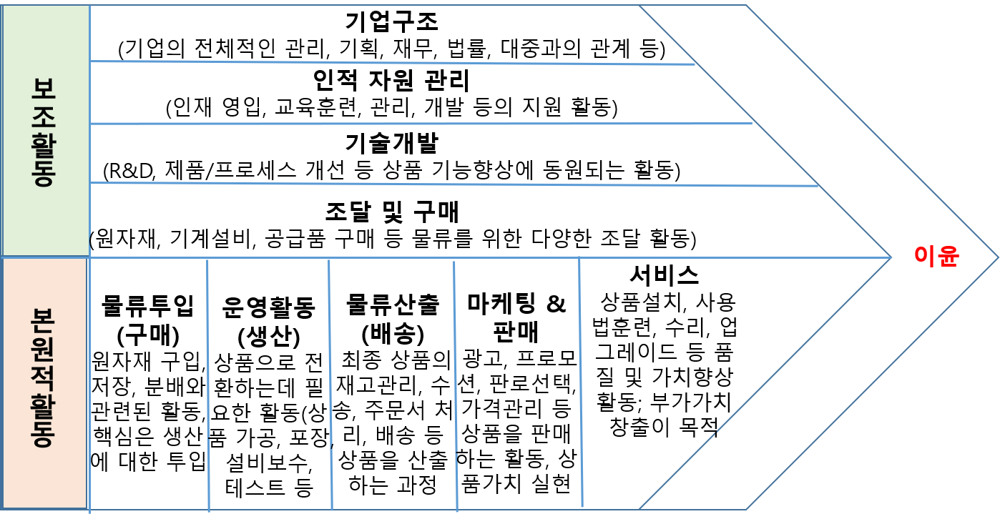

## 밸류체인분석이란?

밸류체인(가치사슬)은 본원적 활동(구매, 물류, 생산, 마케팅, 영업, 서비스 등)과 지원활동(기업구조, 인적 자원, 기술정도, 조달 및 구매)으로 구분되며, 이러한 가치사슬은 기업 내부뿐만 아니라 기업 외부의 공급자, 구매자, 사용자와 연결되어 다양한 관계를 형성하게 됨.  

<그림 5> 가치사슬(value chain) 분석의 개념과 본원적/보조 활동 구성도  
출처: 시장성 분석 교육자료(한국기업기술가치평가협회, 2018), ㈜비즈웹코리아 자료 참조

따라서, 밸류체인 분석은 기업의 핵심역량을 개발하고 제한적인 자원을 효율적으로 사용하기 위한 내부역량 분석 지원툴로서, 다양한 경쟁기업과 비교분석을 통해서 대상 기업이 가지고 있는 상대적인 강점과 약점을 파악하려는 목적도 있음.
