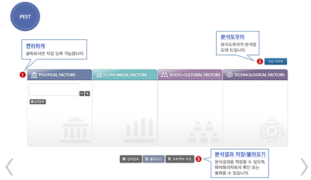
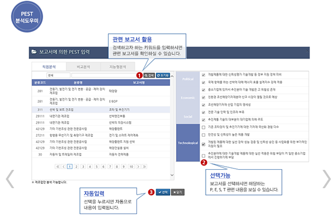
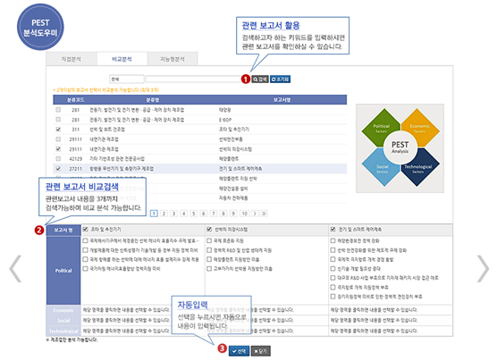

## 산업시장환경 분석: PEST분석 - KMAPS
#### (KMAPS > 환경분석 > PSET)

- 분석도우미 기능을 이용할 경우, 분석하고자 하는 산업(품목)과 일치하는 보고서가 KMAPS에 있는 경우 이를 활용하여 PEST 분석을 진행할 수 있음. 관련 보고서가 다수인 경우, 보고서 중복 선택이 가능하며 해당되는 P, E, S, T 내용을 확인하여 분석을 진행할 수 있음.

- 또한 지능형 분석의 경우, 분석하고자 하는 산업(품목)을 KSIC 코드 기반으로 검색하여 선택하면 KMAPS 시스템에서 해당 산업(품목)내 관련 보고서 내용 중 적합도가 높은 항목을 우선 추천하여 사용자가 PSET 분석에 활용할 수 있도록 함.

