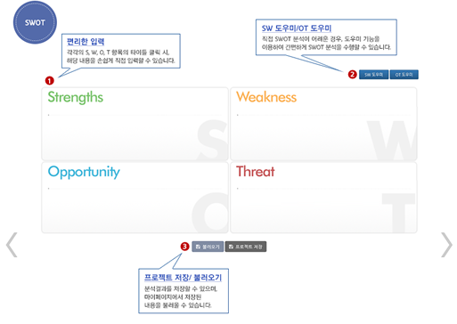
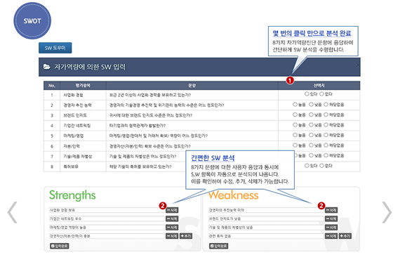
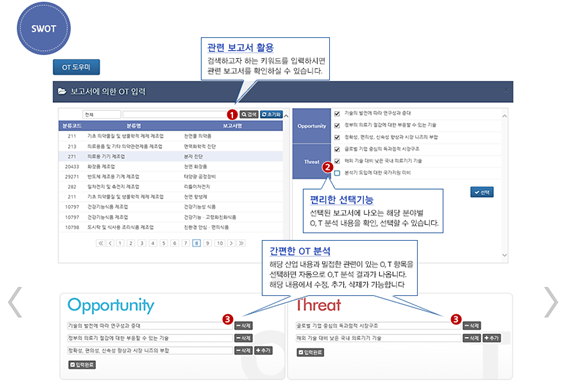

## 산업시장환경 분석: SWTO분석 - KMAPS
##### (KMAPS > 환경분석 > SWOT)

- SW 분석도우미 기능은 사용자가 8가지 자가역량진단 문항에 응답함으로써 간편하게 S, W 항목에 대해 분석할 수 있음. OT 분석도우미 기능의 경우, KMAPS 시스템에 관련 보고서가 있는 경우 이를 활용하여 O, T 내용을 확인하고, 사용자가 이를 선택하여 분석에 활용할 수 있음.

