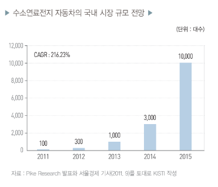

# 수소연료자동차의 국내 시장 규모는?

우리나라의 현대·기아자동차를 비롯하여 GM, 혼다, 도
요타 등 대형 완성차 기업들은 향후 2015년을 수소연료전
지 자동차의 상용화 시점으로 정하고 막바지 기술 고도화
에 박차를 가하고 있습니다.
2011년 현재 북미, 유럽 및 아시아를 중심으로 500여
대의 실증이 이루어지고 있으며 국내에서는 현대·기아자
동차가 2015년 약 1만 대 생산을 목표로 약 100대를 모니
터링하고 있는 것으로 알려졌습니다.

한편, 2011년 4월 시장조사기관인 파이크리서치의 발표
에 따르면 전 세계 수소연료전지 자동차 시장은 2015년을
기점으로 고속 성장해 2020년 누적 판매량 120만 대를 기
록할 것으로 보았습니다. 또 2014년 1만 대, 2015년 5만 7,000
대의 시장이 형성된 뒤 2020년 39만 대가 보급될 것으로 
예상했습니다. 

## 참고문서
- 19-2012_신재생에너지-상용화가_임박한_수소연료전지_자동차.pdf