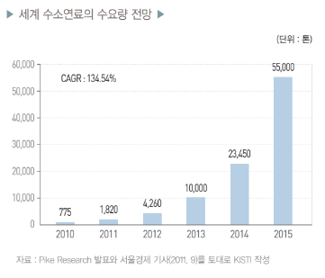

# 수소연료자동차 시장의 성장률은?

수소에너지 관련 전문가들에 따르면 2015년 전후에 수
소에너지 시대가 열리고 2020년쯤에 수소경제사회로 진
입하면 수소연료전지 자동차의 상용화가 본격화될 것으로
예상됩니다. 이와 관련하여 미국 시장조사기관인 파이크리
서치(Pike Research)는 2011년 8월에 세계 수소연료 수요
량이 2010년 775톤에서 2015년 5만 5,000톤, 2020년 41만
8,000톤으로 급격히 확대될 것으로 예상했습니다.

## 참고문서
- 19-2012_신재생에너지-상용화가_임박한_수소연료전지_자동차.pdf