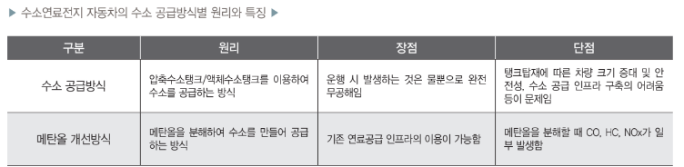

# 수소연료자동차 - 개념

연료전지란 연료와 산화제를 전기화학적으로 반응시켜 전기에너지를 발생시키는 장치이며, 수소연료전지는 수소를연료로, 산소를 산화제로 이용해 전기를 발생시키는 장치입니다. 수소는 공기 중 연소 시 극소량의 질소산화물(NOx)의 발생을 제외하고는 공해물질이 생성되지 않습니다. 그리고 직접연소에 의한 연료로서 사용이 간편하고, 가스나 액체로 쉽게 수송될 수 있으며, 고압가스, 액체수소, 금속수소화물 또는 수소흡장합금 등의 다양한 형태로 저장이 용이합니다. 또한 수소는 궁극적으로 무한정인 물을 원료로 하여 제조할 수 있으며, 사용 후 다시 물로 재순환이 가능합니다. 수소연료는 일반 연료, 수소자동차, 수소비행기, 연료전지 등 현재의 에너지시스템에서 사용되는 대부분의 분야에 이용이 가능하다는 장점이 있습니다. 수소에너지시스템을 실용화하기 위해서는 수소를 싼 값으로 대량 생산할 수 있는 제조 기술, 경제적인 저장과 수송 및 연료전지 등과 같은 다양한 이용 기술 확보가 선행돼야 합니다.

수소연료전지와 수소연료전지 자동차는 서로 분리해서 생각할 수 없는 필요충분조건의 명제라고 할 수 있습니다. 수소연료전지의 가장 큰 활용수요처가 수소연료전지 자동차 로 될 것이기 때문입니다. 수소연료전지 자동차는 수소를 직접 태우지 않고 수소와 공기 중 산소를 반응시켜 발생하는 전기로 모터를 돌려 구동력을 얻는 친환경 자동차를 말합니다. 연료비가 가솔린의 1/3 정도이며, 이산화탄소 배출을 줄일 수 있다는 장점 이 있습니다.

## 참고문서
- BOSS Report: 19-2012_신재생에너지 - 상용화가 임박한 수소연료전지 자동차_.pdf
