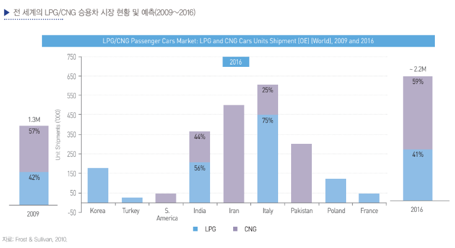

# 액화 천연가스 자동차 - 해외 시장 크기

CNG/LPG 시장에서 LPG의 경우는 이탈리아, 대한민국, 인도, 폴란드, 터키가 주도하고 있지만, CNG 자동차 시장은 이란, 파키스탄, 인도, 이탈리아가 주도하고 있
습니다. 2009년 말 현재 두 시장의 규모는 130만 대 규모로 그중에서 CNG가 57%를 차지하고 있지만, 2016년에는 220만대에 이를 것으로 예상되며 그중에서 CNG 자동차는 59%에이를 전망입니다. 우리가 CNG 자동차에 보다 주목해야 하는이유가 바로 여기에 있는데, 연평균 7.8%의 높은 시장 성장률은 물론 LPG 자동차 이상의 세계 시장 규모가 CNG 자동차 시장의 매력을 높여주고 있습니다.

지역별로 살펴보면, 이탈리아를 제외하면 CNG 자동차가비교적 덜 활성화 되어 있는 유럽 시장은 향후 확대가 기대됩니다. 비록 정유사의 로비로 LPG에 대한 보조금 지급이 계속되겠지만, 유럽에서 CNG 자동차는 높은 시장 성장률이 기대됩니다. 이탈리아, 독일, 오스트리아, 스위스는 공공 충전 시설이 비교적 잘 갖춰져 있어 다양한 차종으로 확대 적용이예상되며, 스페인과 프랑스는 충전 시설의 미비로 버스나 시내 청소 트럭 등에 먼저 적용될 것으로 예상됩니다. 자동차에 의한 대기 공해 감축 전략이 유럽과 비슷한 남미 국가에서도 CNG 자동차는 확대될 전망인데 콜롬비아와 볼리비아가 대표적입니다. 아시아에서는 인도의 성장세가 주목되는데 높아지는 대기 오염을 완화하기 위해 CNG 자동차의 보급이 장려되고 있기 때문입니다. 이란은 2가지 연료의 겸용 사용이 의무화되어 있기 때문에 지속적인 시장 성장이 기대되지만, 아직 보조금이 없는 중국 시장은 좀 더 지켜볼 필요가 있습니다. 북미시장은 아직 판매가 미미하지만 향후 확대가 기대되고 있습니다.

## 참고문서
- BOSS Report: 17-2013_CNG 자동차.pdf
