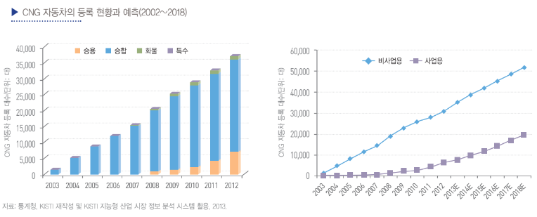

# 액화 천연가스 자동차 - 국내 시장 크기

국내에는 CNG 전용 자동차가 시판되기 오래전부터 개조 차량이 등록되고 있었습니다. 현재에도 버스를 제외한 대다수의 CNG 차량이 개조 차량입니다. 따라서 시장 현황을 판단하기 위해서는 개조 차량이 포함된 등록 현황을 살펴보아야 합니다. 등록 기준으로 CNG 자동차는 2003년 1,376대(승합 1,369대, 화물 6대, 승용 1대)를 시작으로 9년이 지난 2012년 말에는 37,003대(승합 29,011대, 승용 6,810대, 화물 1,179대, 특수3대)까지 크게 증가했습니다. 최근 9년간 연평균 성장률(CAGR 기준)은 44.2%, 최근 5년간 연평균 성장률은 19.3%로 비약적인 성장을 보였습니다. 동기간 전체 자동차 등록 대수는 1,459만 대(2003년)에서 1,887만 대(2012년)로 각각 2.9%(최근 9년)와 2.8%(최근 5년) 성장하는데 그쳤습니다. CNG 자동차와 많이 비교되는 LPG(Liquefied Petroleum Gas) 자동차의 등록 현황과 비교해도 CNG 자동차의 성장세는 두드러집니다. 앞서 설명된 LNG가 메탄을 주성분으로 한다면, LPG는 석유나 유전 가스 에서 추출되는 부탄과 프로판을 주성분으로 한다는 것이 차이점입니다. 2003년 LPG 자동차는 172만 대에서 2012년에는 242만 대로 각각 3.8%(최근 9년)와 2.0%(최근 5년) 성장했습니다. 비록 규모 면에서 아직 CNG 자동차는 일천하지만 성장세만큼은 다른 자동차를 압도하고 있는 것입니다.

CNG 자동차의 등록 현황을 구체적으로 살펴보면 차종별로 볼 때는 승합차의 비중이 압도적으로 높아서 2012년 기준 으로 78.4%에 이르렀습니다. 그러나 위 그림에서 나타난 바와 같이 최근에는 CNG 승용 자동차의 비중이 높아지고 있는데, 2012년에는 18.4%에 이르렀습니다. 용도별로 보면 비사업용의 비중이 매우 높아서 2012년을 기준으로 83.3%에 이르렀습니다. 그러나 사업용은 최근에 그 비중이 크게 높아지는 경향을 보이고 있었습니다.

## 참고문서
- BOSS Report: 17-2013_CNG 자동차.pdf
