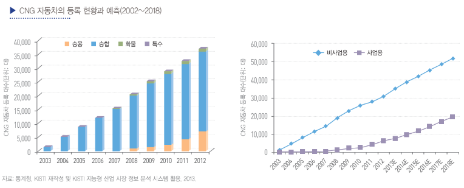

# 액화 천연가스 자동차 -시장의 성장률은?

KISTI는 수요 예측을 위해서 각각의 추세에 가
장 설명력이 높은 시계열 추정법을 활용해 향후 시장을 추정
해 보았습니다. 비사업용 CNG 자동차 수요는 선형 추세를 바탕
으로 추정했으며, 사업용 CNG 자동차 수요는 다항식 추세를
바탕으로 추정했습니다. 이런 예측에 따르면, 2018년에는 비사업
용 CNG 자동차의 비중이 72.6%까지 낮아지는 것으로 예상
되었는데, 전체적으로는 2012년 37,003대의 CNG 등록 차량
이 2018년에는 71,461대까지 증가할 것으로 예측되었습니다. 비사
업용과 사업용 차량의 연평균 성장률은 각각 8.1%와 20.5%
에 이르며, 전체적으로 10.8%의 성장이 기대되었습니다. 최근 5년
에 비하면 낮아지겠지만, 여전히 LPG나 전체 자동차의 증가
추세와 비교하면 매우 높은 성장이 기대되는 것입니다.

## 참고문서
- 17-2013_CNG 자동차.pdf
