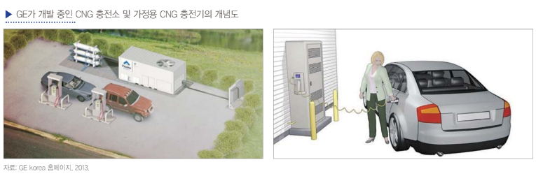

# 액화 천연가스 자동차 - 개념

우리는 도로에 나가면 빈번하게‘CNG 천연가스’라는 표시가 부착된 버스를 만나게 됩니다. 여기서 CNG는 집에서 난방이나 취사용으로 사용하는 도시가스처럼 천연가스의 한 형태인데, 트럭, 버스 등의 연료로 사용할 수 있게 고압으로 압축해 부피를 줄인 압축천연가스(CNG: Compressed Natural Gas)를 의미합니다. 천연가스는 가스전에서 소비자까지 유통되거나 저장되는 형태에 따라 PNG(Pipeline Natural Gas), LNG(Liquefied Natural Gas), CNG로 나누어 볼 수 있습니다. PNG는 기체 상태 그대로 파이프를 통해 공급하는 천연가스이고, LNG는 운송이 쉽도록 냉각시켜 부피를 줄인 액화천연가스이며, CNG는 운송 연료로 쓰기 위해 초고압으로 압축해부피를 줄인 압축천연가스입니다.

그런데 이렇게 운송 연료로 고안된 CNG는 아직 일반 운전자들이 쉽게 사용할 수 없는 연료입니다. CNG 충전기는 구입하고 설치하는 데 큰 비용이 들어서 충전소가 흔하지 않은데다충전 시간도 오래 걸리기 때문입니다. 이런 어려움 때문에 CNG는 다양한 이점에도 불구하고 일반 자동차 연료로 상용화하기 쉽지 않았습니다(GE KOREA 홈페이지 참조). 그런데 이런 기술적 한계에도 불구하고 CNG는 이미 대형 버스나 트럭에 사용될 수 있는 거의 유일한 친환경 연료이기 때문에 국내 시내버스가 CNG 버스로 대체된 것이며, 정부에서는 상용차의 개조에 보조금을 지원하고 있는 것입니다. 전기자동차를 중심으로 한 친환경 자동차 기술이 기대만큼 빨리 발전하지 못하고있는 지금 디젤자동차는 우수한 기술력을 바탕으로 클린 디젤기술로 경쟁하고 있으며, CNG나 LPG는 대체 연료 사용을통한 친환경 기술로 전기자동차의 부진을 파고들고 있습니다.

## 참고문서
- BOSS Report: 17-2013_CNG 자동차.pdf
