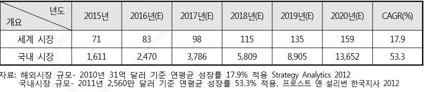

# 운전자 보조 시스템 시장의 미래시장규모는?
자동차는 기계적 성격의 단순 기기에서 소프트웨어, 인공지능, 클라우드, 센서 기술 등이 복합된 협력형 융합기기로 진화되고 있습니다. 이는 과거 단순 전화 기능 중심의 이동 통신수단에서‘전화기의 재발명’으로까지 표현되는 스마트폰으로의 시장 변화·발달 현상과 유사한 양상입니다. 
2009년 말 출시된 아이폰 3GS 등장을 시작으로 불과 4년 만인 2013년도에 전체 휴대폰 시장에서 스마트폰의 시장 비중은 50%를 초과하였습니다. 복합 기술이 접목된 ADAS 자동차 시장 흐름은 스마트폰의 시장 변화 현상과 비슷한 유형을 보일 것으로 예상되며 고도의 기술력을 확보한 업체의 시장 선점이 예상됩니다.
Gartner에 따르면 전 세계 반도체 제조 장비 시장 규모는 2012년 378억 달러에서 2018년 477억 달러 로 연평균 7.4% 성장하였습니다. 자동화 테스트 장비에 대한 매출은 2012년부터 2018년까지 연평균 6.1% 성장하여 2018년 기준 246억 달러로 전망됩니다.

## 참고문서
- 8-2016-기술 융·복합으로 탄생된 첨단 운전자 보조 시스템.pdf