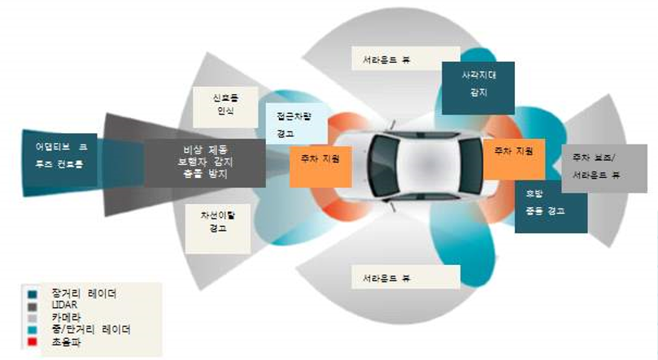

# 운전자 보조 시스템이란?
첨단 운전자 보조 시스템 (ADAS: Advanced Driver Assistance Systems)이란 차량 내·외부에 탑재되어 있는 센서들을 활용하여 운전자의 편의, 안전, 돌발 상황에 대한 위험 회피 등의 목적으로 운전자 를 지원하는 시스템을 말합니다.   
ADAS의 도입으로 기계 역학적인 기술로만 구성되었던 자동차에서 전기·전자, 정보 통신 등의 다양 한 기술들이 접목·융합되어 차량 자체에서 주행 환경인식, 교통사고예방 등의 교통 인프라 개선 등이 가능해졌으며, 운전미숙에 대한 보완 및 이동 중 정보 활용 가능 등의 운전자 편의성이 높아지게 되었다. 
이러한 ADAS 기술의 특징은 주변 상황 인식을 위한 측위기술, 센서 시스템, 클라우드 기반 자율 주행 서비스 시스템 등이 있으며, 주행 안정성과 신뢰성 확보를 위하여 Fail Safety (자동차 조향장치 및 제동장치 고장 시 운전자 개입 전까지 자동차 안전 확보 위한 기술) 기반의 지능형 작동기 (Smart Actuator) 및 운전자-차량 인터페이스 모듈 기술 등의 운행제어 시스템이 있습니다. 
대표적인 ADAS 기술로서 측위 기술은 가장 널리 사용되고 있는 것이 GPS 등의 위성정보를 활용하는 전파항법 방식이 있습니다. 이 방식은 지구 좌표계를 이용하여 절대 위치를 실시간으로 제공하며 위치에 대한 오차가 누적되지 않는다는 장점이 있으나, 전파 수신 상태에 따른 정밀도가 낮아질 수 있다는 단점이 있습니다.
이를 보완키 위하여 관성측정 장치 (IMU: Inertial Measurement Unit) 등을 이용하는 기술 들이 활용됩니다.
운전자의 안전에 대하여 차체 내부에서 처리해야 하는 운행제어 시스템으로는 즉각적으로 장애물과의 거리를 측정해서 자동으로 브레이크를 걸어주는 자율 비상 정지 시스템 (AEB: Autonomous Emergency Braking), 자동으로 정속 주행을 도와주는 적응식 정속 주행 시스템 (ACC: Adaptive Cruise Control), 차선이탈 경고 (LDW: Lane Departure Warning), 차선 유지 보조 장치 (LKA: Lane Keeping Assist), 사각지대 감시 장치 (BSD: Blind Spot Detection), 주차를 돕는 서라운드 뷰 모니터 (SVM: Surround View Monitor) 등 다양한 기능들이 있습니다.
위와 같은 기능들은 공통적으로 외부환경을 인식하기 위해 센서의 역할이 중요하며 이에 따라 카메라, 레이더 등의 운전자 보조 시스템 센서 시장이 빠르게 성장하고 있습니다.DAS 시장의 선두업체인 도요타, BMW 등의 완성차 업체는 물론 최근에는 구글, 마이크로소프트, 애 플 등의 IT 기업들에서도 ADAS를 이용한 자율 주행 자동차 상용화 사업을 추진 중이며 이를 구현하 기 위한 첨단 운전자 보조 시스템에 대한 연구가 빠르게 진행되고 있습니다.

## 참고문서
- 8-2016-기술 융·복합으로 탄생된 첨단 운전자 보조 시스템.pdf