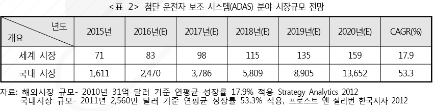

# 운전자 보조 시스템 - 해외 시장 시장 크기

첨단 운전자 보조 시스템의 세계 시장규모는 2010년 31억 달러에서 2019년 135억 달러 규모로 연 평균 17.9%의 성장률이 예상됩니다. 북미, 아시아·태평양, 서유럽 지역의 첨단 운전자 보조 시스템 장착 차량은 2020년 8,000대에서 2035년 9,540만 대로 연평균 성장률 85%가 기록될 전망이고, 2035년 전체 자동차 판매량 중 75%가 자율 주행 자동차 일 것으로 예상 됩니다.

미국, 독일 등의 자동차 선진국 들은 기술 장벽을 구축하고 관련 산업의 법제화를 추진하고 있습니다. 미국 네바다, 플로리다 지역 등은 자율 주행 자동차의 도로 시험을 허용하는 방안으로서 주 의회 중심으로 실제 도로에서 테스트가 가능토록 법령을 제정하였으며 하와이, 텍사스, 워싱턴 등의 지역은 법안심사를 위한 준비 중입니다.

## 참고문서
- BOSS 보고서: 8-2016-기술 융·복합으로 탄생된 첨단 운전자 보조 시스템.pdf
