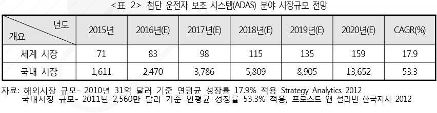

# 운전자 보조 시스템 - 국내 시장의 시장 크기는?

국내의 경우 정부 차원의 산업 간 융합을 통하여 첨단 운전자 보조 시스템의 적용 환경 개선을 위한 기술 개발을 지원하고 있습니다. 산업부에서 13대 산업 엔진 프로젝트 중 자율 주행 자동차를 포함하여 중견·중소기업이 주도 가능한 핵심부품 및 서비스 개발 지원을 추진 중이며 국토부는 국토교통연구 개발 중장기 전략안 10대 프로젝트에 자동차 자율 주행 도로를 포함하여 자율 주행 개발을 위한 도로 관련 제도 개선 연구를 진행하고 있습니다.

이러한 국가지원들과 수요자들의 요구에 따라 첨단 운전자 보조 시스템 시장은 2011년 2,560만 달러에서 2018년 5억 960만 달러에 달해 연평균 53.3%의 높은 성 장률을 보일 전망입니다.

## 참고문서
- BOSS 보고서: 8-2016-기술 융·복합으로 탄생된 첨단 운전자 보조 시스템.pdf
