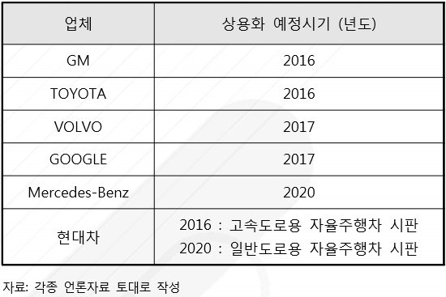
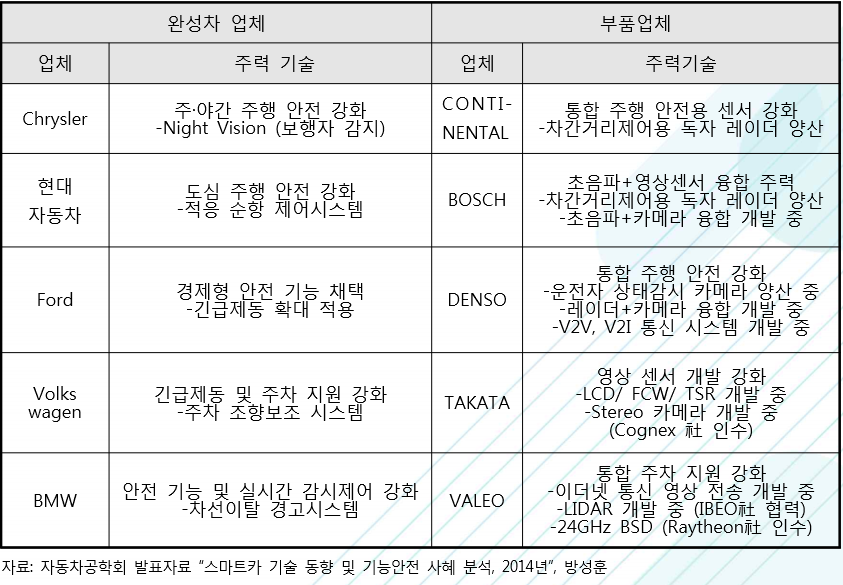

# 운전자 보조 시스템 - 해외 주요 기업

운전자 보조 시스템 시장의 해외 주요 업체에는 GM ,TOYOTA , VOLVO , GOOGLE , Mercedes-Benz ,현대차 등이 있습니다. 완성차 업체들은 타 산업의 기술과 융합된 차량 단위의 기술 개발로 단기간 내에 첨단 운전자 보조 시스템 적용차량의 상용화를 통하여 시장 장벽을 높이려 하고 있습니다.

제너럴 모터스(GM)는 고속도로 한정 첨단 운전자 보조 시스템 적용차량을 2017년 이내에 출시한다고 발표하였으며, Mercedes-Benz 는 2013년도에 ‘S-Class Intelligent Drive’ 기술을 소개하고 CES 2015에서 자율 주행 콘셉트카를 공개 하였습니다.

도요타(TOYOTA)는 ‘도요타 스마트 센서‘를 이용하여 운전자와 차량, 생활공간을 하나로 잇는 클라우드 기반의 콘셉트카 ’Smart INSECT‘를 출시하는 한편 현대자동차는 2020년 일반 도로용 자율 주행 차를 시판할 예정으로 연구개발에 2조 원을 투자할 계획에 있습니다.

한편, IT 업체들도 시장 진입 현상을 보이고 있으며 대표적으로 마이크로소프트(MS)는 차량 내부에서 음성인식, 전화연결, 길 안내 등의 운전자 정보 전달이 가능한 인포테인먼트 운영 체계를 개발하여 완성차 업체들에게 제공하고 있습니다.
구글은 도요타의 프리우스를 개조하여 만든 구글 카를 일반 도로 주행 실험에 성공하였습니다.  

글로벌 완성차 업체들은 개별 부품단위가 아닌 타 산업과의 기술과 융합된 차량 단위의 기술 개발을 진행하고 있으며 자동차 부품업체들은 기술력 강화를 위하여 전자 제어 소프트웨어 향상 기술, 핵심 센서 기술 등의 개발을 통하여 시장 점유율을 확대 중입니다.

대표적으로 자동차 부품회사인 독일의 콘티넨탈은 최근 반도체 회사를 인수하기도 하였으며 보쉬는 충돌 사전 경고장치 등의 안전 예고시스템 부품 등을 개발 중입니다. 주요 완성차 업체 및 부품업체의 첨단 운전자 보조 시스템 개발 동향은 다음과 같습니다.

## 참고문서
- BOSS 보고서: 8-2016-기술 융·복합으로 탄생된 첨단 운전자 보조 시스템.pdf
