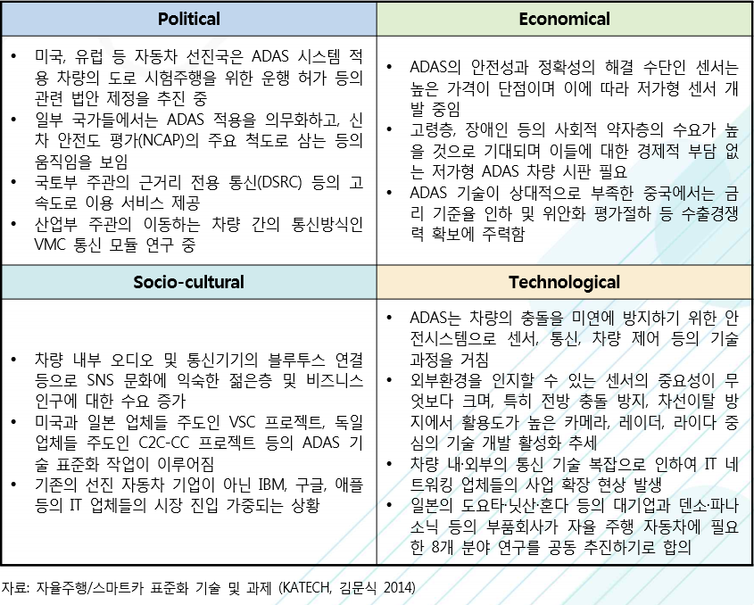

# 운전자 보조 시스템 - PEST 분석

Political(정치적)으로는 미국, 유럽 등 자동차 선진국은 ADAS 시스템 적용 차량의 도로 시험주행을 위한 운행 허가 등의 관련 법안 제정을 추진 중입니다. 일부 국가들에서는 ADAS 적용을 의무화하고, 신 차 안전도 평가(NCAP)의 주요 척도로 삼는 등의 움직임을 보입니다. 국토부 주관의 근거리 전용 통신(DSRC) 등의 고 속도로 이용 서비스 제공합니다.
산업부 주관의 이동하는 차량 간의 통신방식인 VMC 통신 모듈 연구 중입니다.

Economical(경제적)으로는 ADAS의 안전성과 정확성의 해결 수단인 센서는 높은 가격이 단점이며 이에 따라 저가형 센서 개발 중입니다. 고령층, 장애인 등의 사회적 약자층의 수요가 높을 것으로 기대되며 이들에 대한 경제적 부담 없는 저가형 ADAS 차량 시판이 필요합니다.  ADAS 기술이 상대적으로 부족한 중국에서는 금리 기준율 인하 및 위안화 평가절하 등 수출경쟁 력 확보에 주력합니다.

Socio-cultural(사회적)으로는 차량 내부 오디오 및 통신기기의 블루투스 연결 등으로 SNS 문화에 익숙한 젊은층 및 비즈니스 인구에 대한 수요 증가합니다. 미국과 일본 업체들 주도인 VSC 프로젝트, 독일 업체들 주도인 C2C-CC 프로젝트 등의 ADAS 기술 표준화 작업이 이루어집니다. 기존의 선진 자동차 기업이 아닌 IBM, 구글, 애플 등의 IT 업체들의 시장 진입이 가중되는 상황입니다.

Technological(기술적)으로는 ADAS는 차량의 충돌을 미연에 방지하기 위한 안전시스템으로 센서, 통신, 차량 제어 등의 기술 과정을 거칩니다. 외부환경을 인지할 수 있는 센서의 중요성이 무엇보다 크며, 특히 전방 충돌 방지, 차선이탈 방지에서 활용도가 높은 카메라, 레이더, 라이다 중 심의 기술 개발 활성화 추세입니다. 차량 내·외부의 통신 기술 복잡으로 인하여 IT 네 트워킹 업체들의 사업 확장 현상 발생합니다. 일본의 도요타·닛산·혼다 등의 대기업과 덴소·파나 소닉 등의 부품회사가 자율 주행 자동차에 필요한 8개 분야 연구를 공동 추진하기로 합의합니다.

## 참고문서
- BOSS 보고서: 8-2016-기술 융·복합으로 탄생된 첨단 운전자 보조 시스템.pdf
