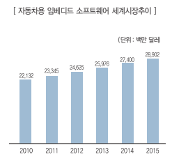

# 임베디드 S/W - 해외시장 크기

임베디드 시스템과 임베디드 소프트웨어는 시장 조사 기관마다 차이가 있으나 전체 산업에서 임베디드 관련 시장은 시장조사 기관에서 예측하는 것보다 훨씬 클 것으로 예상됩니다. 세계 자동차용 임베디드 소프트웨어 시장 규모는 2010년 2천200억 달러에서 2015년 2천900억 달러에 이를 것으로 전망됩니다.

## 참고문서
- BOSS 보고서: 6-2011-자동차용임베디드sw.pdf
