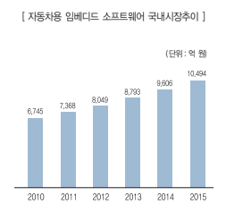

# 임베디드 S/W의 국내시장 크기는?

임베디드 시스템과 임베디드 소프트웨어는 시장 조사 기관마다 차이가 있으나 전체 산업에서 임베디드 관련 시장은 시장조사 기관에서 예측하는 것보다 훨씬 클 것으로 예상됩니다.

국내 임베디드 소프트웨어 시장은 자동차 시장의 성장과 일본 대지진으로 인한 반사이익으로 규모가 커질 것으로 예상됩니다. 

국내 임베디드 소프트웨어 기업의 강점 분야는 차량용 오디오 및 내비게이션 등 인포테인먼트(Infotainment) 관련분야입니다.

## 참고문서 
- 6-2011-자동차용임베디드sw.pdf