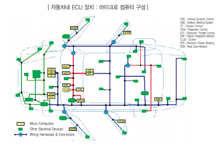

# 임베디드 S/W란?

자동차용 임베디드 소프트웨어는 자동차의 안전성, 경제성, 편리성을 구현하기 위한 ECU를 운영하는 핵심기술입니다.

오늘날의 자동차는 기능이 지능형 자동차로 발전해 감에 따라 초기의 에어백 장치, 안전벨트 등의 초보적인 수준에서 점차 주행 중 브레이크 페달을 밟았을 때 바퀴가 잠겨 미끄러지는 것을 방지하는 기술인 ABS(Anti-lock Braking System), 차량의 횡축 움직임을 감지하여 차량이 주행 중 미끄러짐을 방지하는 VDC(Vehicle Dynamic Control), 미끄럽거나 젖은 노면에서 출발 혹은 가속 시에 바퀴가 미끄러지는 것을 방지하는 TCS(Traction Control System), 앞차와의 거리를 자동으로 조절하는 기술인 SCC(Smart Cruise Control) 등과 차량내부의 네트워크 기술(LIN, CAN, FlexRay)이상호 연동하여 동작하게 되었습니다.

## 참고문서
- 6-2011-자동차용임베디드sw.pdf