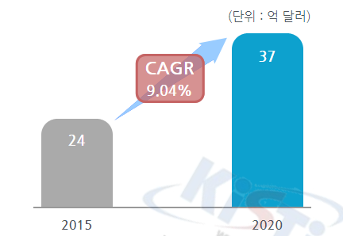

# 자동차용 NOx 센서 시스템 - 해외시장 규모

자동차 가스 센서의 해외시장규모는 2015년 24억 달러에서 2020년 37억 달러로 증가, 연평균 9.0%의 증가율을 보일 전망입니다.

## 참고문서
- KISTI 유망아이템 지식 베이스: [http://boss.kisti.re.kr/boss/item/item_print.jsp?unit_cd=PI000015](http://boss.kisti.re.kr/boss/item/item_print.jsp?unit_cd=PI000015)
