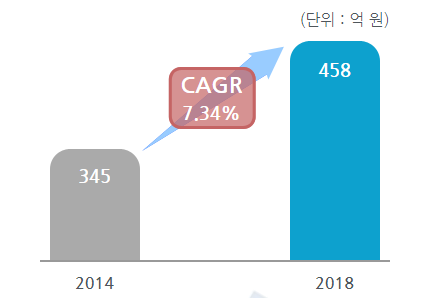

# 자동차용 NOx 센서 시스템의 국내시장 규모

자동차용 NOx 센서 시스템의 국내시장규모는 2014년 345억 원에서 2018년 458억 원으로 증가, 연평균 7.3%의 증가율을 보일 전망입니다.

## 참고문서
- KISTI 유망아이템 지식 베이스: http://boss.kisti.re.kr/boss/item/item_print.jsp?unit_cd=PI000015