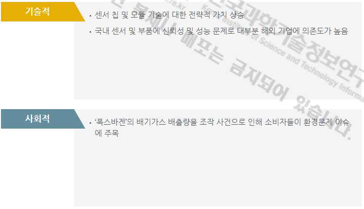

# 자동차용 NOx 센서 시스템시장의 PEST 분석

정치적 분석입니다.‘한국-EU연합 FTA 자동차 작업반 회의’에서 이동식 배출가스 측정장비(PEMS)를 도입하고 공동기준 마련을 논의하고 있습니다. 그리고 환경부에서 실도로 배출가스 관리제도 도입 예정입니다.
경제적 분석입니다. 자동차 시장에 대한 투자가 활성화되고 있습니다. 그리고 다양한 형태의 센서가 여러 산업분야에서 적용되고 있으며 IoT시대에 산업활용도가 증가할 전망입니다.
기술적 분석입니다. 센서 칩 및 모듈 기술에 대한 전략적 가치가 상승하고 있습니다. 그리고 국내 센서 및 부품에 신뢰성 및 성능 문제로 대부분 해외 기업에 의존도가 높아지고 있습니다.
사회적 분석입니다. 폭스바겐’의 배기가스 배출량을 조작 사건으로 인해 소비자들이 환경문제 이슈에 주목하고 있습니다.

## 참고문서
- KISTI 유망아이템 지식 베이스: http://boss.kisti.re.kr/boss/item/item_print.jsp?unit_cd=PI000015