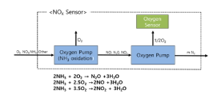

# 자동차용 NOx 센서 시스템의 정의
 
내연기관의 배기가스 중 NOx(질소산화물)의 농도를 측정하기 위한 장비로 배기가스 규제가 강화되는 추세에 따라 수요가 증가하고 있습니다.

내연기관의 NOx(질소산화물) 배출 규제가 세계적으로 강화되는 추세로 SCR(선택적 촉매 환원) 시스템 적용이 확산되고 있으며 효과적인 SCR시스템 설계를 위해 NOx 센서가 필수적으로 적용되고 있습니다.

질소산화물 후처리 기술로는 크게 LNT(Lean NOX Traps), LNC(Lean NOX Catalysts), SCR(Selective Catalytic Reduction)이 제시되고 있습니다.

이 중 Urea-SCR 시스템은 배출가스에 Urea를 환원제로 분사함으로써 질소산화물을 선택적으로 환원하여 배출가스 내 질소산화물을 저감시켜주는 시스템으로, 다른 후처리 기술에 비해 상대적으로 정화효율 특성이 우수한 것으로 나타나 EURO-6 이상의 배기가스 규제에 대응하기에 가장 유리한 기술로 평가됩니다.

SCR 시스템에서 Urea 환원제의 정확한 투여를 하므로 효과적인 NOx 저감을 달성하고 암모니아 슬립을 방지하기 위해, NOx 농도를 측정하는 NOx 센서를 장착했습니다.

 
## 참고문서
- KISTI 유망아이템 지식 베이스: http://boss.kisti.re.kr/boss/item/item_print.jsp?unit_cd=PI000015