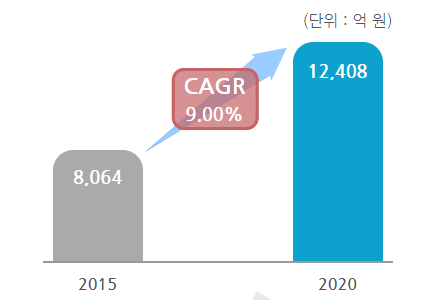

# 자동차용 리튬전지 국내 시장의 시장 크기는?

자동차용 리튬전지의 국내 시장규모는 2015년 8,064억 원에서 2020년 1조 2,408억 원으로 증가, 연평균 9%의 성장률을 보일 전망입니다. 
2009년 경제 불황의 여파로 인해 리튬이온 배터리 산업의 전체적인 생산량 감소가 있었으나, 이후 국내 기업들의 지속적인 
재료비 절감 노력으로 시장 점유율을 확대하고 있습니다. 

## 참고문서
- KISTI 유망아이템 지식 베이스: http://boss.kisti.re.kr/boss/item/item_print.jsp?unit_cd=PI000135