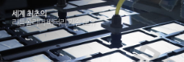

# 자동차용 리튬전지시장의 국내 주요 업체는?

자동차용 리튬전지시장의 국내 주요 업체로는 삼성SDI와 코캄이 있습니다. 

삼성SDI는 
2000년도 CMP· EMS·전지소재· PASTE, ISO 901 추가인증하였고 
2001년도 2차전지 전해액 중국10만톤/월 수출 체결하였습니다. 
2005년도 최고 에너지 밀도 노트PC용, PMP용 연료전지 세계 최초 개발, 
2008년도 일본 IIT의 리튬이온 전지업체 종합평가 1위 발표,
2010년도 전기자동차용 전지공장 준공,
소형 이차전지사업부문 세계시장 점유율 1위 달성,
2014년도 중국 시안市 전기자동차 배터리 공장 건설 기공식, 
2015년도 중국 JAC에 전기차용 원형 배터리를 공급하였습니다. 

이차전지 소재 연구개발 강화하여 최근 이차전지 시장이 소형 이차전지 중심에서 자동차용 이차전지, ESS용 이차전지 등 
중대형 전지 시장으로 확대되고, 특히 전기 자동차를 충전할 때 주행거리 확대 및 시스템 솔루션 경쟁력 확보가 
중요해짐에 미래 기존 소재의 한계를 극복하기 위한 기술개발에 주력하고 있습니다. 이와 함께 이차전지를 사용하는 기기들이 
많아지고 업체 간 경쟁이 심화됨에 따라 어플리케이션의 사용 시간을 최대한 늘리고 이차전지의 충전 시간을 줄이기 위해 
기존 소재의 성능 향상과 고용량 신소재에 대한 연구개발을 강화하고 있습니다. 

코캄은 1998 이차전지 사업 시작, 
1999 리튬이온폴리머 전지(SLPB) 개발, 
2003 전지 양산 기계장비 및 시스템 판매, 
고 성능의 20C-rate & 30C-rate 셀 개발,
2006 전 세계 최초 200Ah 이상 대형 셀 개발, 
2007 LTO (Lithium Titanium Oxide) 배터리 생산 시작, 
2009 Nano Cell 개발 및 전세계 특허 등록 세계 2위 자동차 부품 업체인 캐나다 MAGNA 와 기술계약을 하였습니다.

코캄은 1998년 80여 개 이상의 SLPB(Superior Lithium Polymer Battery) 개발을 시작으로 대형 리튬폴리머전지 시장을 개척하며 
이차전지 솔루션 기업으로 성장해왔습니다. 코캄의 SLPB는 전 세계적으로 약 50개국 이상의 국가에 수출함으로써 
이차전지 시장의 글로벌 리더로 자리매김하고 있습니다. 코캄은 특화된 적층 공법인 “Z-fold” 기술에 초점을 맞추어 
지난 10여 년간 연구개발에 매진하였으며, 그 결과 물리적 저항이 작아 대용량 설계 및 순간 입력, 출력 전류(C-rate)가 높은 
전지를 제조하는데 성공하였습니다. 1998년 이후, 코캄은 중소형 및 대형 전지(15Ah ~ 240Ah)에 이르기 까지 다양한 
제품을 시장에 선보이고 있습니다.

## 참고문서
- KISTI 유망아이템 지식 베이스: http://boss.kisti.re.kr/boss/item/item_print.jsp?unit_cd=PI000135