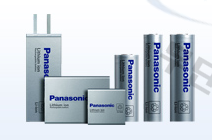

# 자동차용 리튬전지시장의 해외 주요 업체는?

Panasonic은 1918년 설립된 일본의 종합 가전제품 생산회사로 마쓰시타 전기기구 제작소에서 2008년 파나소닉으로 사명을 변경, 
산요전기를 자회사함으로 다양한 1차 및 2차 전지를 개발 및 생산하여 폭넓은 전지 라인업, 사이즈를 갖추고 있습니다.

초기 전기차 배터리 시장은 파나소닉을 중심으로 한 일본 업체가 주도하였습니다. 기술력이 가장 뛰어나다는 평가를 받는 선도국가인 
일본은 초기 단계 시장이지만, 점유율도 가장 높습니다.  
전기차 배터리 1위 기업인 파나소닉은 전기차 기업 테슬라와 거의 독점계약을 맺고 배터리를 공급 중으로 현재 오사카 공장에서 
테슬라에 공급하는 배터리를 생산하여, 전기차 배터리 시장에서 선전 중입니다. 

## 참고문서
- KISTI 유망아이템 지식 베이스: http://boss.kisti.re.kr/boss/item/item_print.jsp?unit_cd=PI000135