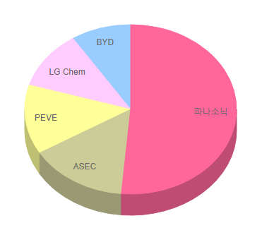
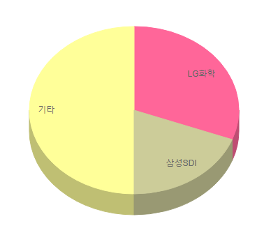

# 자동차용 리튬전지 시장점유율 분석

자동차용 리튬전지의 해외 경쟁사로는 파나소닉, ASEC, PEVE, BYD 등이 존재합니다. 전기차 배터리 점유율 1위는 일본 파나소닉으로 약 2.2GWh를 출하하며 시장점유율 40.4%를 달성한 것으로 나타납니다. 이어 AESC(11.8), PEVE(10.4%) 등 일본 업체들의 강세가 이어지고 있습니다. 다음으로 국내 주요 경쟁사로는 LG화학, 삼성SDI가 주도하고 있는 구조이며, 세방전지, SK에너지, 벡셀, 코캄을 비롯한 다양한 기업들이 존재합니다.

국내 기업인 LG화학과 삼성 SDI은 각각 0.5GWh, 0.3GHw를 출하하며 점유율 4위(8.8%)와 6위(3.9%)에 이름을 올리며 점점 강세를 나타내고 있습니다.

## 참고문서
- KISTI 유망아이템 지식 베이스: http://boss.kisti.re.kr/boss/item/item_print.jsp?unit_cd=PI000135
