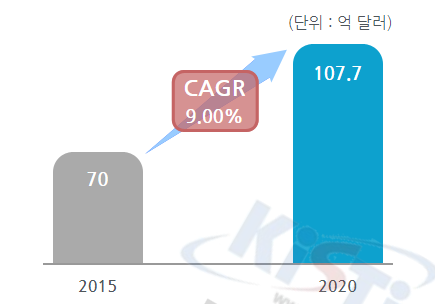
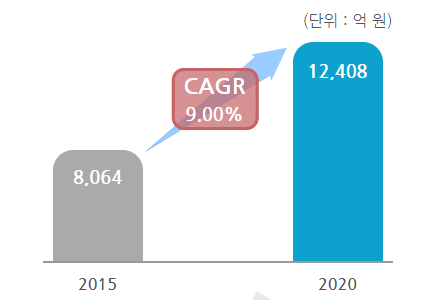

# 자동차용 리튬전지 시장의 성장률

자동차용 리튬전지의 전세계 시장규모는 2015년 70억 달러에서 2020년 107억 7,000만 달러로 증가했으며 연평균 9%의 성장률을 보일 전망입니다.
세계 리튬 이차전지 시장은 1991년 일본 소니가 세계 최초로 상용화한 이후 20년 이상 일본 업체들의 독주가 이어졌습니다.
2000년 중반 이후에는 한국 기업들의 독자적인 기술개발, 가격경쟁력 확보, 주요 고객이자 계열사인 삼성전자, LG전자의 성장 등을 통해 일본 기업들을 넘어서기 시작했습니다. 

자동차용 리튬전지의 국내 시장규모는 2015년 8,064억 원에서 2020년 1조 2,408억 원으로 증가했으며 연평균 9%의 성장률을 보일 전망입니다.
2009년 경제 불황의 여파로 인해 리튬이온 배터리 산업의 전체적인 생산량 감소가 있었으나, 이후 국내 기업들의 지속적인 재료비 절감 노력으로 시장 점유율을 확대하고 있습니다.

## 참고문서
- KISTI 유망아이템 지식 베이스: http://boss.kisti.re.kr/boss/item/item_print.jsp?unit_cd=PI000135
