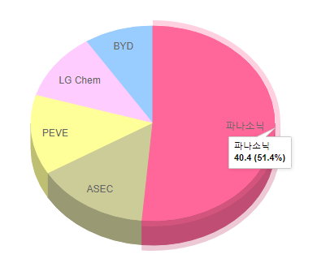

# 해외 자동차용 리튬전지 시장의 기업별 점유율

자동차용 리튬전지의 해외 경쟁사로는 파나소닉, ASEC, PEVE, BYD 등이 존재합니다. 
전기차 배터리 점유율 1위는 일본 파나소닉으로 약 2.2GWh를 출하하며 시장점유율 40.4%를 달성했습니다. 
이어 AESC(11.8), PEVE(10.4%) 등 일본 업체들의 강세가 이어집니다. 
그 뒤로 LG Chem이 8.8%, BYD가 7.2%로 차지하고 있습니다.

## 참고문서
- KISTI 유망아이템 지식 베이스: http://boss.kisti.re.kr/boss/item/item_print.jsp?unit_cd=PI000135