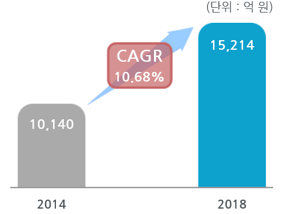

# 자동차용 센서 - 국내시장 크기

자동차용 센서 국내시장규모는 2014년 약 1조 원에서 2018년 약 1.5조 원으로 증가, 연평균 10.7%의 증가율을 보일 전망입니다.

## 참고문서
- KISTI 유망아이템 지식 베이스: [http://boss.kisti.re.kr/boss/item/item_print.jsp?unit_cd=PI000017](http://boss.kisti.re.kr/boss/item/item_print.jsp?unit_cd=PI000017)
