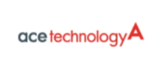

# 자동차용 센서 - 국내 주요 기업
국내시장은 영상센서 모듈화 업체의 세코닉스, 엠씨넥스, LG이노텍 , 레이더 센싱 시스템의 현대모비스, 만도, LIG넥스원, 삼성탈레스, 에이스테크놀로지, LG이노텍, 인팩일렉스, 디지탈엣지 등 ,차량용 인식 및 검출 SW 개발업체의 PLK테크놀러지, 베라시스, 엠아이웨어, 베이다스, 이미지넥스트, 아진산업 , 시스템 통합 및 제품화의 현대모비스, 만도, SL, LG전자가 있습니다.

에이스테크놀로지는 통신장비기업 에이스테크놀로지는 자동차에서 지상파와 라디오 등 방송을 수신하고 위성항법장치(GPS) 등 기능을 하는 '샤크안테나' 공급을 추진 중 이며, 또한 자율주행의 핵심으로, 자동차가 주행 중일 때 주변상황을 실시간 감지하고 운전자에게 신속히 전달하는 차량용 레이더 사업도 준비 중입니다.

## 참고문서
- KISTI 유망아이템 지식 베이스: [http://boss.kisti.re.kr/boss/item/item_print.jsp?unit_cd=PI000017](http://boss.kisti.re.kr/boss/item/item_print.jsp?unit_cd=PI000017)
