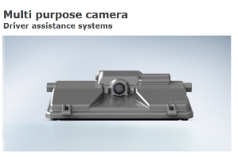

# 자동차용 센서 -
# 자동차용 센서의 해외 주요업체에는 어떤 것이 있는지?
해외시장에는 CMOS의 Aptina, Omnivision, Melexis ,MCU 및 플랫폼의 TI, ARM, Renesas&NEC, Mobileye ,레이더 센싱 시스템의 델파이, 보쉬, 컨티넨탈, 덴소, 헬라, 후지즈텐 등 , 영상처리 및 제품화기술의 Mobileye(이스라엘) Boch(독), Hella(독), Continental(독), Valeo(프), Denso(일), 후지쯔텐(일), Magna(캐), TRW(미), Delphi(미)이 있습니다.

Robert Bosch는‘14년말 120mm의 카메라 간격을 지닌 소형의 스테레오 카메라를 개발하였고, 이는 유럽의 자동차 OEM이 요구하는 사양을 만족하고 있어 시장선도가 예상됩니다.

## 참고문서
- KISTI 유망아이템 지식 베이스: [http://boss.kisti.re.kr/boss/item/item_print.jsp?unit_cd=PI000017](http://boss.kisti.re.kr/boss/item/item_print.jsp?unit_cd=PI000017)
